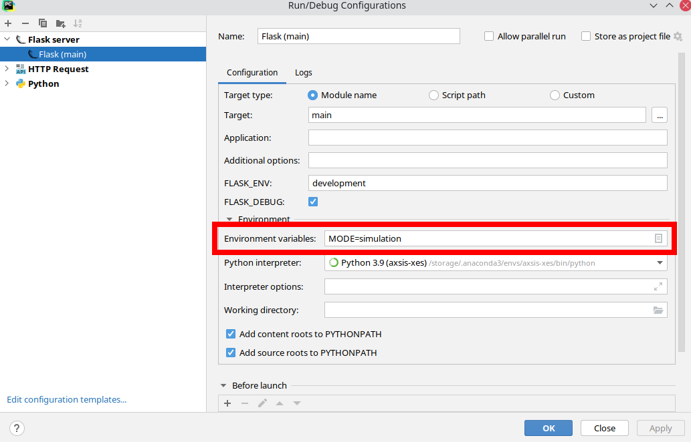
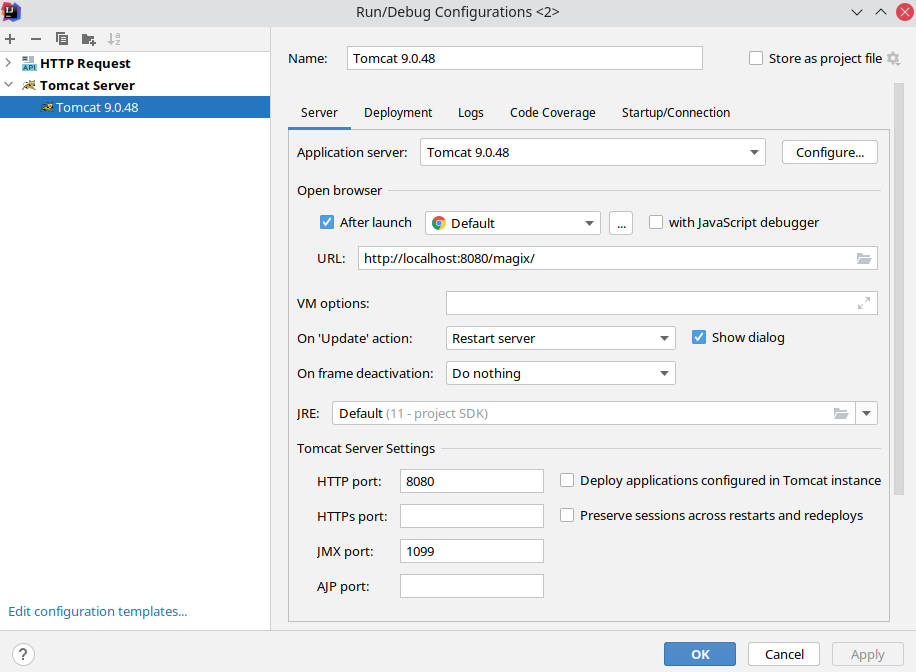

# AXSIS-XES

This is a meta project that links all the repositories related to the axsis xes slow control system

| Purpose | Platform | Link |
|---------|----|------|
| Backend | Python 3.6+ | [axsis-xes](https://github.com/waltz-controls/axsis-xes)     |
| Middleware | Java 11+ | [magix](https://github.com/waltz-controls/magix-war-plugin) |
| Frontend | NodeJS 12+ | [axsis-gui](https://github.com/waltz-controls/axsis-xes-gui) |
| Tango Host   | Java 11+ | [virtual-host](https://github.com/waltz-controls/axsis-virtual-tango-host) |
| Tango Server | Java 11+ | [virtual-server](https://github.com/waltz-controls/axsis-tango-server) |
| Kubernetes | Microk8s | [axsis-kube](https://github.com/waltz-controls/axsis-kube) |

# Getting started for developers

To setup development environment one needs at least three projects: Backend, Middleware, Frontend

Here is how each of them can be set up for development:

## Backend

One will need PyCharm Professional and a Python environment (3.6+) installed on their system, however Conda is advised. Currently backend consists of two runnable:

`main.py` -- REST API. This is a Flask application and requires corresponding dependencies, run `pip install -r Requirements.txt` to install them. Configure PyCharm accordinly: [tutorial](https://www.jetbrains.com/help/pycharm/creating-flask-project.html)

This is how `Run configuration...` may look like:

`axsis.magix.py` -- Magix client. This is just a runnable Python script: [tutorial](https://www.jetbrains.com/help/pycharm/creating-and-running-your-first-python-project.html#run)

> NOTE: Both applications require enironmental variable `MODE` to be set to either `simulation|production`. In case of `production` a gateway to the underlying hardware will be created.

## Middleware 

Middleware is a Magix component that supports http/sse transports. Currently Java 11+ version is used. Java Magix is a standard Java JAX-RS web application deployed to Tomcat. To setup it one will need IntelliJ IDEA Ultimate + Tomcat 9.x server: [tutorial](https://www.jetbrains.com/help/idea/run-debug-configuration-tomcat-server.html) 

Here is how `Run configuration...` setup screen may look like:

> Please note default http port: 8080. Other components expect Magix to be on `localhost:8080`

## Frontend

Frontend is a NodeJS application hence requires WebStorm and a Node 12+ environment, `nvm` is advised (serves same purpose as `Conda` for Python). To start application execute `npm install && npm run start` this will launch the web server on `localhost:8081`, provided that middleware is already running.

# Publications 

[1] [Mazalova, V.; Khokhriakov, I.; Merkulova, O.; Nozik, A. A Novel Solution for Controlling Hardware Components of Accelerators and Beamlines. Preprints 2021, 2021080336 (doi: 10.20944/preprints202108.0336.v1).](https://www.preprints.org/manuscript/202108.0336/v1)
